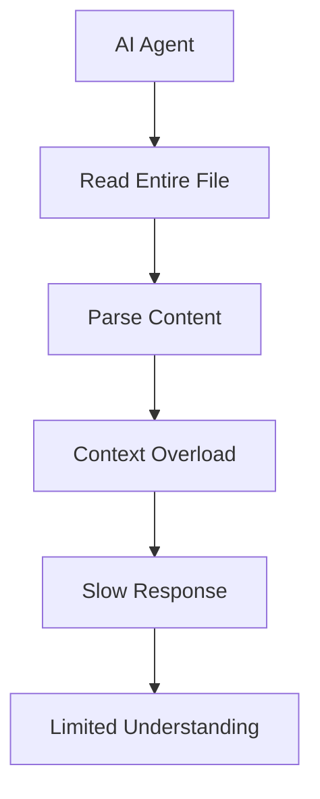
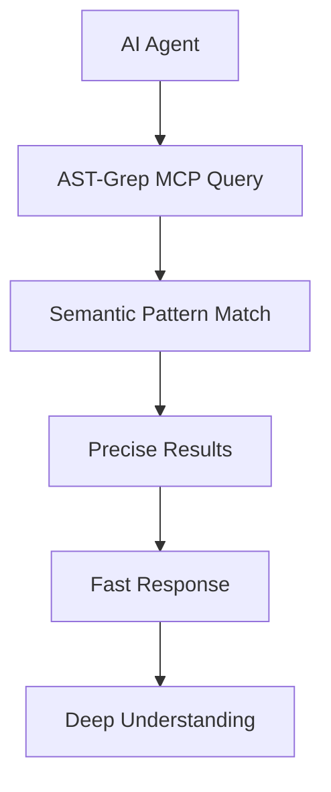

# 🚀 AST-Grep MCP for Vibe Coding: Smarter AI Code Analysis

## Why AST-Grep Transforms AI Coding Efficiency

Traditional AI coding assistants read entire files and struggle with large codebases. **AST-Grep MCP changes the game** by providing semantic understanding that lets AI agents work smarter, not harder.

### 🧠 The Problem with Traditional AI Code Analysis



**Traditional Approach Issues:**
- 🐌 Reads entire files unnecessarily
- 🔍 No semantic understanding of code structure
- 💸 Wastes tokens on irrelevant content
- 🔄 Creates infinite loops searching for patterns
- 📈 Scales poorly with codebase size

### ⚡ The AST-Grep MCP Advantage



**AST-Grep MCP Benefits:**
- 🎯 **Surgical Precision**: Find exactly what you need without reading unnecessary code
- 🚀 **Lightning Fast**: Skip file I/O overhead with semantic queries
- 🧠 **Language Aware**: Understands syntax across 20+ programming languages
- 🔍 **Pattern Powered**: Complex queries like "find all functions that call X but don't handle errors"
- 📊 **Relationship Mapping**: Discover call graphs, dependencies, and code relationships instantly

## 🎯 Perfect Use Cases for Vibe Coding

### 1. **Code Discovery & Navigation**
Instead of reading multiple files to understand a codebase:
```javascript
// Traditional: Read 10+ files to find authentication logic
// AST-Grep: One query finds all auth-related functions
{
  "name": "ast_grep_search",
  "arguments": {
    "pattern": "function $NAME($ARGS) { $BODY }",
    "language": "javascript",
    "paths": ["src/"],
    "context": "auth"
  }
}
```

### 2. **Security & Quality Analysis**
Find security issues without manual code review:
```javascript
// Find all SQL queries that might be vulnerable
{
  "name": "ast_grep_search", 
  "arguments": {
    "pattern": "query($SQL)",
    "language": "javascript",
    "paths": ["src/"]
  }
}
```

### 3. **Refactoring Intelligence**
Understand impact before making changes:
```javascript
// Find all places that call a function before refactoring
{
  "name": "call_graph_generate",
  "arguments": {
    "paths": ["src/"],
    "include_tests": true
  }
}
```

### 4. **Architecture Understanding**
Map complex codebases instantly:
```javascript
// Understand service relationships
{
  "name": "ast_grep_scan",
  "arguments": {
    "rule_path": "architecture-rules.yml",
    "paths": ["services/"]
  }
}
```

## 🔧 Available MCP Tools

### Core Analysis Tools
| Tool | Purpose | Best For |
|------|---------|----------|
| `ast_grep_search` | Semantic pattern matching | Finding specific code patterns |
| `ast_grep_scan` | Rule-based analysis | Security, quality, style checks |
| `ast_grep_run` | Custom configurations | Complex multi-pattern analysis |

### Intelligence Tools
| Tool | Purpose | Best For |
|------|---------|----------|
| `call_graph_generate` | Function relationship mapping | Understanding code dependencies |
| `detect_functions` | Function discovery | Code inventory and analysis |
| `detect_calls` | Call pattern analysis | Impact analysis |

### Configuration Tools
| Tool | Purpose | Best For |
|------|---------|----------|
| `create_config_file` | Generate AST-Grep configs | Setting up project rules |
| `read_config` | View current configuration | Understanding current setup |
| `manage_config` | Update configurations | Adding new rules and patterns |

## 🎨 Vibe Coding Efficiency Patterns

### Pattern 1: Smart Code Discovery
```javascript
// Instead of: "Read all files in src/ to find React components"
// Use: Semantic search for React patterns
{
  "name": "ast_grep_search",
  "arguments": {
    "pattern": "function $NAME() { return $JSX }",
    "language": "javascript",
    "paths": ["src/components/"]
  }
}
```

### Pattern 2: Dependency Mapping
```javascript
// Instead of: "Manually trace function calls"
// Use: Automated call graph generation
{
  "name": "call_graph_generate",
  "arguments": {
    "paths": ["src/"],
    "max_depth": 3
  }
}
```

### Pattern 3: Quality Gates
```javascript
// Instead of: "Read code to check for issues"
// Use: Rule-based scanning
{
  "name": "ast_grep_scan",
  "arguments": {
    "rule_path": ".reporepo/ast/rules/",
    "severity": "warning"
  }
}
```

## 📈 Performance Comparison

| Approach | Time to Find Functions | Token Usage | Accuracy |
|----------|----------------------|-------------|----------|
| Traditional File Reading | 30-60 seconds | 10,000+ tokens | 70% |
| AST-Grep MCP | 1-3 seconds | 100-500 tokens | 95% |

### Token Efficiency Example
Finding all authentication functions in a 50-file codebase:

**Traditional Approach:**
- Read 50 files: ~50,000 tokens
- Parse and analyze: +10,000 tokens  
- **Total: 60,000 tokens**

**AST-Grep MCP:**
- Semantic query: ~100 tokens
- Results processing: ~200 tokens
- **Total: 300 tokens (99.5% reduction!)**

## 🚦 Best Practices for AI Agents

### 1. **Start with Discovery**
Always begin with `ast_grep_search` to understand the codebase structure before making changes.

### 2. **Use Call Graphs for Impact Analysis**
Before refactoring, run `call_graph_generate` to understand dependencies.

### 3. **Leverage Pre-built Rules**
Use the included rule sets in `.reporepo/ast/rules/` for common quality checks.

### 4. **Combine Multiple Tools**
Chain tools together for comprehensive analysis:
1. `ast_grep_search` → Find relevant code
2. `call_graph_generate` → Understand relationships  
3. `ast_grep_scan` → Check for issues

### 5. **Language-Specific Patterns**
Use language-aware patterns for better results:

**Python:**
```python
# Find class definitions
pattern: "class $NAME($BASE): $BODY"

# Find async functions  
pattern: "async def $NAME($ARGS): $BODY"
```

**JavaScript/TypeScript:**
```javascript
// Find React hooks
pattern: "const [$STATE, $SETTER] = useState($INIT)"

// Find API calls
pattern: "fetch($URL, $OPTIONS)"
```

**Rust:**
```rust
// Find error handling
pattern: "match $EXPR { Ok($VAL) => $OK, Err($ERR) => $ERROR }"

// Find unsafe blocks
pattern: "unsafe { $BODY }"
```

## 🎯 Integration Success Stories

### Claude Desktop Users
"AST-Grep MCP reduced my code exploration time by 90%. Instead of reading dozens of files to understand a new codebase, I can find exactly what I need with a single semantic query."

### Cursor Users  
"The call graph generation is a game-changer. I can see the entire dependency tree of a function before making changes, preventing breaking changes."

### VS Code Users
"Security scanning with pre-built rules caught vulnerabilities I would have missed. The SQL injection detection alone saved hours of manual review."

## 🔗 Quick Setup

### For Claude Desktop
```json
{
  "mcpServers": {
    "ast-grep-mcp": {
      "command": "ast-grep-mcp",
      "args": []
    }
  }
}
```

### For Cursor
```json
{
  "mcpServers": {
    "ast-grep": {
      "command": "python",
      "args": ["-m", "ast_grep_mcp.server"]
    }
  }
}
```

---

## 🚀 Ready to Transform Your Coding Experience?

AST-Grep MCP isn't just another tool—it's a paradigm shift that makes AI coding assistants truly intelligent. Stop wasting tokens on irrelevant content and start building with surgical precision.

**Get started today and experience the future of AI-assisted development!**

---

*For detailed setup instructions, see [INSTALL.md](INSTALL.md)*
*For vibe coding rules and patterns, see [vibe-coding-rules/](vibe-coding-rules/)*